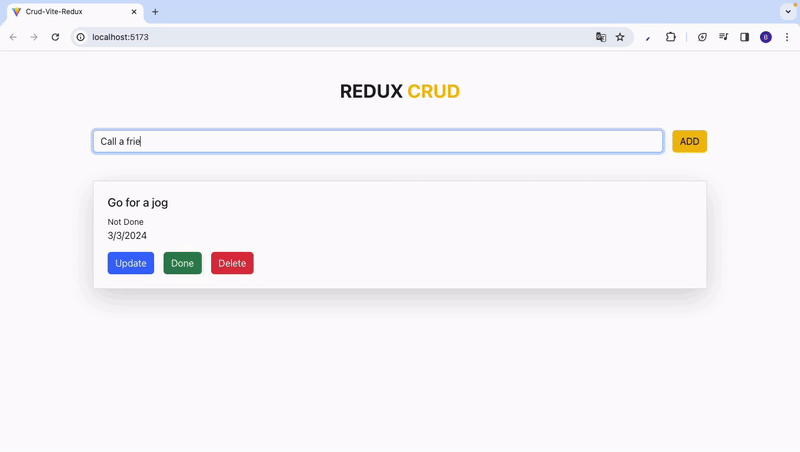

<h1>CRUD-TODO_redux_</h1>

This project developed with Redux encompasses a CRUD TODO application created using React. Essentially, it is a task management application where users can easily manage their tasks. Basic CRUD operations such as adding new tasks, viewing existing tasks, updating, and deleting them are supported. All these operations are persisted to the API behind the application. This enables users to effectively manage their tasks while leveraging the powerful state management features of Redux to maintain the application state.

<h2> Software Languages </h2>

- HTML

- CSS

- JavaScript

<h2> Libraries </h2>

- React

- Redux

- React Router DOM

- Axios

<h2> Development Tools </h2>

- Vite

<h2> Frameworks </h2>

- Bootstrap

<h2> Screen Gif </h2>

